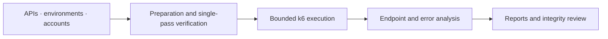

<div align="center">

<picture>
  <source media="(prefers-color-scheme: dark)" srcset="docs/assets/hero-dark.svg">
  <source media="(prefers-color-scheme: light)" srcset="docs/assets/hero-light.svg">
  
</picture>

<h1>Pressure Platform</h1>

<strong>From API preparation to results you can inspect.</strong>

<p>A Chinese-language performance-testing workspace built on TestHub.<br>Django, Vue 3 and k6 connect preparation, execution and reporting.</p>

[](docs/getting-started.md)
[](testhub/frontend/)
[](testhub/docs/k6-capability-matrix.md)
[](LICENSE)

<p>
  <a href="#quick-start">Quick start</a> ·
  <a href="docs/README.md">Documentation</a> ·
  <a href="docs/architecture.md">Architecture</a> ·
  <a href="testhub/docs/k6-capability-matrix.md">Capabilities</a> ·
  <a href="CONTRIBUTING.md">Contributing</a>
</p>

<a href="README.md">简体中文</a> · <strong>English</strong>

</div>

---

## Beyond sending requests

The difficult part of a load test is often not starting it. It is knowing whether requests were prepared correctly, identities were independent, work actually completed, and the report explains failures or missing data.

Pressure Platform connects those concerns into one workflow: **prepare, verify, execute within bounds, then inspect the evidence.** It is a management and analysis layer over k6, not a new load-generation engine. Upstream k6 features are not automatically available through this platform.

<table>
<tr>
<td width="50%" valign="top">
<h3>01 / Reusable preparation</h3>
<p>Import and update OpenAPI / Swagger definitions. Organize projects, persistent environments and dependencies, then verify configurations before reusing them.</p>
</td>
<td width="50%" valign="top">
<h3>02 / Explicit identities</h3>
<p>Account pools, CSV identities, extractors and per-VU setup make authentication part of the configuration rather than hidden script state.</p>
</td>
</tr>
<tr>
<td valign="top">
<h3>03 / Bounded execution</h3>
<p>Use constant concurrency with per-user iteration counts or a duration. Keep timed draining, manual stops and incomplete work distinct from success.</p>
</td>
<td valign="top">
<h3>04 / Scoped protocols</h3>
<p>Use the integrated HTTP subset, finite JSON WebSocket sessions and bounded SSE scenarios. Supported subsets, dependencies and undelivered features are explicit.</p>
</td>
</tr>
<tr>
<td valign="top">
<h3>05 / Inspectable reports</h3>
<p>Review per-endpoint statistics, error categories and native VU observations where supported. Export HTML, JSON and CSV for further analysis.</p>
</td>
<td valign="top">
<h3>06 / Honest execution records</h3>
<p>Keep failures, incomplete work, missing observations and recovery records distinguishable. A green status is not a substitute for execution integrity.</p>
</td>
</tr>
</table>

## One connected workflow



The header and diagram are workflow illustrations, not product screenshots or measured benchmark results. See the [architecture guide](docs/architecture.md) for implementation boundaries.

<a id="quick-start"></a>

## Quick start

Local development requires **Python 3.12+, Node.js 22.12+, npm and Git**. Executing a load test also requires a matching k6 runner. No precompiled engine, business accounts or target service is bundled.

```sh
git clone --recurse-submodules https://github.com/chasen2041maker/Pressure_Platform.git
cd Pressure_Platform
```

For an existing checkout, run `git submodule update --init --recursive`. The `vendor/k6` submodule pins source code; it does not install an executable.

<details>
<summary><strong>Start the local management UI</strong></summary>

Create and activate a virtual environment from the repository root:

```sh
python -m venv .venv
# Linux/macOS: source .venv/bin/activate
# Windows PowerShell: .venv\Scripts\Activate.ps1
python -m pip install -r deployment/requirements-local.txt
```

Initialize an independent local secret. An existing valid secret is preserved:

```sh
python -c "import sys; from pathlib import Path; sys.path.insert(0, 'deployment/linux-docker'); from runtime_tools import ensure_secret; ensure_secret(Path('runtime/private').resolve())"
```

Start the backend:

```sh
cd testhub
python manage.py migrate --settings=backend.pressure_settings
python manage.py createsuperuser --settings=backend.pressure_settings
python manage.py runserver 127.0.0.1:8000 --settings=backend.pressure_settings
```

In a second terminal, from the repository root:

```sh
cd testhub/frontend
npm ci
npm run dev -- --host 127.0.0.1 --port 58101
```

Open `http://127.0.0.1:58101` and sign in with the administrator you created. Create your own project, environment and test accounts. This profile is for local development only.

Keep `runtime/private/django-secret.txt` and the entire runtime directory out of Git. When overriding `PRESSURE_PLATFORM_ROOT`, initialize the secret under that root's `runtime/private/` instead. A working management UI does **not** mean the runner is ready.

</details>

| Next step | Guide |
| --- | --- |
| Local setup and troubleshooting | [Getting started](docs/getting-started.md) |
| Configure a real execution runner | [k6 adapter](testhub/docs/k6-adapter.md) and [pinned SSE runtime](deployment/runtime/bounded-sse/README.md) |
| Review single-host Linux deployment | [Docker deployment draft](deployment/linux-docker/README.md) — **public images and deployment are not yet validated** |

The application UI and detailed operational guides are currently in Chinese. This README provides the English overview and local startup commands.

## Know the boundaries

| Area | Platform entry point | Important limit |
| --- | --- | --- |
| HTTP | Sequential requests, basic assertions and extraction | Not the complete `k6/http` API |
| WebSocket | Finite JSON sessions | No arbitrary binary traffic, automatic reconnect or unrestricted protocol scripts |
| SSE | Custom bounded extension | Requires the pinned runtime, not an arbitrary k6 binary |
| Load models | Constant concurrency; iterations or duration | Ramping, arrival-rate models and distributed scheduling are not delivered; instance tasks run serially |
| Metrics | Endpoint statistics, errors and reports | Native VUs are sampled observations; UI P95/P99 values are cumulative histogram estimates |

The versioned [capability matrix](testhub/docs/k6-capability-matrix.md) is the detailed reference. Functional verification, report reconciliation and target-service capacity acceptance are different claims.

## Evidence, not headline numbers

<details>
<summary><strong>Public-source validation recorded on 2026-09-22</strong></summary>

These are existing results from [VALIDATION.md](VALIDATION.md), not tests newly executed for this documentation refresh or a CI status for the current commit.

| Scope | Recorded result |
| --- | --- |
| Maintained backend suite | 430 passed, 40 skipped, 0 failed |
| Frontend performance components and logic | 317 passed |
| k6 script contracts | 55 passed |
| Standalone deployment tools | 33 static tests passed; no Docker connection |
| Frontend production build | Passed with a large-chunk warning |

The full legacy suite has known issues and must **not** be described as entirely passing. Skips are not passes. Public Linux images, Docker deployment and target-service capacity remain unvalidated. See the original record for reproduction commands and qualifications.

</details>

## Explore the documentation

[Documentation hub](docs/README.md) · [Architecture](docs/architecture.md) · [Interface preparation](deployment/interface-pool.md) · [Bounded policies](deployment/bounded-execution.md) · [Recovery](deployment/reminder-recovery.md) · [Contributing](CONTRIBUTING.md)

## Contributing and provenance

Reproducible [issues](https://github.com/chasen2041maker/Pressure_Platform/issues) and focused improvements are welcome. Read the [contribution guide](CONTRIBUTING.md) first. Test only systems you own or are authorized to test; never publish real credentials, tokens, internal addresses or business execution reports.

Maintained by [chasen2041maker](https://github.com/chasen2041maker), derived from [TestHub](https://github.com/chenjigang4167/testhub_platform) and powered by [Grafana k6](https://github.com/grafana/k6). This is not a wholly original implementation. The root license is **GPL-3.0**; k6 and other dependencies retain their own licenses and copyright notices. See [UPSTREAM.md](UPSTREAM.md) and [LICENSE](LICENSE).

<p align="center"><sub>Prepare deliberately. Run within bounds. Inspect the evidence.</sub></p>
