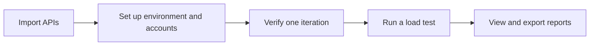

<div align="center">

<picture>
  <source media="(prefers-color-scheme: dark)" srcset="docs/assets/hero-dark.svg">
  <source media="(prefers-color-scheme: light)" srcset="docs/assets/hero-light.svg">
  
</picture>

<h1>Pressure Platform</h1>

<strong>A web UI for API load testing with k6</strong>

<p>Configure requests and test accounts, run load tests, and view reports in your browser.</p>

[](docs/getting-started.md)
[](testhub/frontend/)
[](testhub/docs/k6-capability-matrix.md)
[](LICENSE)

<p>
  <a href="#quick-start">Quick start</a> ·
  <a href="docs/README.md">Docs</a> ·
  <a href="docs/architecture.md">Architecture</a> ·
  <a href="testhub/docs/k6-capability-matrix.md">Supported features</a> ·
  <a href="CONTRIBUTING.md">Contributing</a>
</p>

<a href="README.md">简体中文</a> · <strong>English</strong>

</div>

---

## About

Pressure Platform adds k6 load testing to TestHub. It uses Vue 3 for the frontend and Django for the backend. k6 sends the actual requests.

Import an API definition, set up an environment and test accounts, and run a single iteration to check the configuration. Then choose a concurrency level and duration for the load test. Reports show response times, errors and request completion counts by endpoint, with exports for further analysis.

## Features

<table>
<tr>
<td width="50%" valign="top">
<h3>API management</h3>
<p>Import and update OpenAPI / Swagger definitions. Configure request parameters, extractors and prerequisites, and reuse verified configurations.</p>
</td>
<td width="50%" valign="top">
<h3>Environments and accounts</h3>
<p>Save test environments and manage independent account pools. Use CSV account data and per-virtual-user login steps.</p>
</td>
</tr>
<tr>
<td valign="top">
<h3>Load configuration</h3>
<p>Set a fixed concurrency level and run by iteration count or duration. Stop a test manually, or allow in-flight requests to finish within a time limit when a timed run ends.</p>
</td>
<td valign="top">
<h3>Protocols</h3>
<p>Test HTTP requests, finite JSON WebSocket sessions and bounded SSE streams through a custom extension. See the supported features table for limits.</p>
</td>
</tr>
<tr>
<td valign="top">
<h3>Monitoring and reports</h3>
<p>View per-endpoint statistics, error categories and native VU samples where collection is supported. Export reports as HTML, JSON and CSV.</p>
</td>
<td valign="top">
<h3>Execution records</h3>
<p>Check failed requests, incomplete requests, missing metric samples and recovery records when troubleshooting a run.</p>
</td>
</tr>
</table>

## Workflow



The header and diagram illustrate the workflow; they are not application screenshots. See [architecture](docs/architecture.md) for the code structure.

<a id="quick-start"></a>

## Quick start

Local development requires **Python 3.12+, Node.js 22.12+, npm and Git**.

```sh
git clone --recurse-submodules https://github.com/chasen2041maker/Pressure_Platform.git
cd Pressure_Platform
```

For an existing checkout, run `git submodule update --init --recursive`. The `vendor/k6` submodule contains pinned engine source, not a compiled binary. Configure a matching runner before executing load tests.

<details>
<summary><strong>Local setup commands</strong></summary>

Create and activate a virtual environment from the repository root:

```sh
python -m venv .venv
# Linux/macOS: source .venv/bin/activate
# Windows PowerShell: .venv\Scripts\Activate.ps1
python -m pip install -r deployment/requirements-local.txt
```

Create a local secret. This preserves an existing valid secret:

```sh
python -c "import sys; from pathlib import Path; sys.path.insert(0, 'deployment/linux-docker'); from runtime_tools import ensure_secret; ensure_secret(Path('runtime/private').resolve())"
```

Set up the database, create an administrator and start the backend:

```sh
cd testhub
python manage.py migrate --settings=backend.pressure_settings
python manage.py createsuperuser --settings=backend.pressure_settings
python manage.py runserver 127.0.0.1:8000 --settings=backend.pressure_settings
```

In a second terminal, from the repository root:

```sh
cd testhub/frontend
npm ci
npm run dev -- --host 127.0.0.1 --port 58101
```

Open `http://127.0.0.1:58101` and sign in with the administrator you created. Add your own project, environment and test accounts; none are bundled. The backend runs at `http://127.0.0.1:8000`. This profile is for local development only.

Keep `runtime/private/django-secret.txt` and the runtime directory out of Git. When setting a custom `PRESSURE_PLATFORM_ROOT`, create the secret under that root's `runtime/private/` directory instead. Runner configuration is a separate step.

</details>

| Task | Guide |
| --- | --- |
| Local setup and troubleshooting | [Getting started](docs/getting-started.md) |
| Runner configuration | [k6 adapter](testhub/docs/k6-adapter.md) and [SSE extension build instructions](deployment/runtime/bounded-sse/README.md) |
| Linux deployment | [Docker deployment draft](deployment/linux-docker/README.md); public images and deployment have not completed validation |

The application UI and detailed guides are currently in Chinese. This README includes an English overview and local setup commands.

## Supported features

The platform exposes a subset of k6, not the entire k6 API.

| Feature | Supported | Limits |
| --- | --- | --- |
| HTTP | Sequential requests, basic assertions and extraction | Not the complete `k6/http` API |
| WebSocket | Finite JSON sessions | No binary data, automatic reconnect or arbitrary protocol scripts |
| SSE | Custom bounded extension | Requires the matching pinned runtime |
| Load models | Constant concurrency; iterations or duration | No ramping, arrival-rate models or distributed scheduling; tasks run serially within an instance |
| Metrics and reports | Per-endpoint statistics, errors and exports | Native VUs are sampled; UI P95/P99 values are cumulative histogram estimates |

See the [capability matrix](testhub/docs/k6-capability-matrix.md) for versions, configuration fields and related tests.

## Test results

<details>
<summary><strong>Public-source test results from 2026-09-22</strong></summary>

These historical results come from [VALIDATION.md](VALIDATION.md). They are not a CI status for the current commit.

| Check | Result |
| --- | --- |
| Maintained backend suite | 430 passed, 40 skipped, 0 failed |
| Frontend performance components and logic | 317 passed |
| k6 script contracts | 55 passed |
| Deployment tool static tests | 33 passed; no Docker connection |
| Frontend production build | Passed with a large-chunk warning |

The full legacy suite still has known failures. Skipped tests are not included in the pass count. See the original record for details and reproduction commands.

Public Linux images and Docker deployment have not been revalidated, and no target-service capacity acceptance results are published. These checks primarily cover platform functionality; they do not establish how much traffic a target service can handle.

</details>

## Documentation

[Docs index](docs/README.md) · [Architecture](docs/architecture.md) · [Interface preparation](deployment/interface-pool.md) · [Bounded execution](deployment/bounded-execution.md) · [Recovery](deployment/reminder-recovery.md) · [Contributing](CONTRIBUTING.md)

## Contributing

Found a problem? Open an [issue](https://github.com/chasen2041maker/Pressure_Platform/issues) with the version, steps to reproduce and a redacted error message. Bug fixes, tests and documentation improvements are welcome. Please read [CONTRIBUTING.md](CONTRIBUTING.md) before submitting changes.

Run load tests only against systems you own or are authorized to test. Do not publish real credentials, tokens, internal addresses or business reports.

## Credits and license

Maintained by [chasen2041maker](https://github.com/chasen2041maker), built on [TestHub](https://github.com/chenjigang4167/testhub_platform), with [Grafana k6](https://github.com/grafana/k6) as the load generator. Thanks to the authors and contributors of both projects.

The repository retains the **GPL-3.0** license. k6 and other dependencies keep their own licenses and copyright notices. See [UPSTREAM.md](UPSTREAM.md) for upstream versions and modifications, and [LICENSE](LICENSE) for the license text.
