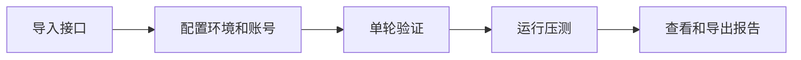

<div align="center">

<picture>
  <source media="(prefers-color-scheme: dark)" srcset="docs/assets/hero-dark.svg">
  <source media="(prefers-color-scheme: light)" srcset="docs/assets/hero-light.svg">
  
</picture>

<h1>Pressure Platform</h1>

<strong>基于 k6 的接口压测平台</strong>

<p>在网页上配置接口、管理测试账号、执行压测和查看报告。</p>

[](docs/getting-started.md)
[](testhub/frontend/)
[](testhub/docs/k6-capability-matrix.md)
[](LICENSE)

<p>
  <a href="#quick-start">快速开始</a> ·
  <a href="docs/README.md">文档</a> ·
  <a href="docs/architecture.md">架构说明</a> ·
  <a href="testhub/docs/k6-capability-matrix.md">支持范围</a> ·
  <a href="CONTRIBUTING.md">参与开发</a>
</p>

<strong>简体中文</strong> · <a href="README.en.md">English</a>

</div>

---

## 项目介绍

Pressure Platform 在 TestHub 的基础上增加了 k6 压测功能。前端用 Vue 3，后端用 Django，实际请求由 k6 发出。

可以先导入接口文档，配置环境和账号，跑一轮确认接口能正常调用，再设置并发数和运行时间。压测结束后，可以按接口查看响应时间、错误和请求完成情况，也可以导出报告继续分析。

## 主要功能

<table>
<tr>
<td width="50%" valign="top">
<h3>接口管理</h3>
<p>导入和更新 OpenAPI / Swagger 文档，配置请求参数、变量提取和前置依赖。验证过的配置可以重复使用。</p>
</td>
<td width="50%" valign="top">
<h3>环境和账号</h3>
<p>保存测试环境，管理独立账号池。支持 CSV 账号数据和每个虚拟用户的前置登录。</p>
</td>
</tr>
<tr>
<td valign="top">
<h3>压测配置</h3>
<p>设置固定并发数，按每个用户的轮数或运行时长执行。运行中可以手动停止，按时长运行时支持在途请求收尾。</p>
</td>
<td valign="top">
<h3>协议支持</h3>
<p>支持 HTTP、有限的 JSON WebSocket 会话，以及使用自定义扩展的有界 SSE。具体限制见下方支持范围。</p>
</td>
</tr>
<tr>
<td valign="top">
<h3>监控和报告</h3>
<p>查看逐接口统计、错误分类，以及支持采集时的原生 VU 数据。报告可以导出为 HTML、JSON 和 CSV。</p>
</td>
<td valign="top">
<h3>执行记录</h3>
<p>记录请求失败、请求未完成、指标未采集等情况，并保留异常执行的恢复记录，方便排查问题。</p>
</td>
</tr>
</table>

## 使用流程



首页横幅和上图是流程示意，不是运行截图。代码结构见 [架构说明](docs/architecture.md)。

<a id="quick-start"></a>

## 快速开始

本地开发需要 **Python 3.12+、Node.js 22.12+、npm 和 Git**。

```sh
git clone --recurse-submodules https://github.com/chasen2041maker/Pressure_Platform.git
cd Pressure_Platform
```

已有仓库执行 `git submodule update --init --recursive`。`vendor/k6` 保存的是固定版本的引擎源码，仓库没有附带编译好的 k6 程序，需要另外配置运行器才能发压。

| 步骤 | 说明 |
| --- | --- |
| 启动本地页面 | 按 [本地启动指南](docs/getting-started.md) 安装依赖、初始化密钥和数据库、创建管理员，再启动前后端 |
| 配置 k6 | 查看 [运行器配置](testhub/docs/k6-adapter.md) 和 [SSE 扩展构建说明](deployment/runtime/bounded-sse/README.md) |
| 部署到 Linux | 参考 [Docker 部署草稿](deployment/linux-docker/README.md)，公开版镜像和部署流程还没有完成实际验收 |

本地前端地址是 `http://127.0.0.1:58101`，后端地址是 `http://127.0.0.1:8000`。用自己创建的管理员登录，添加项目、环境和测试账号。仓库没有预置业务账号和目标地址。

## 支持范围

目前只接入了 k6 的部分功能，并不是完整的 k6 图形界面。

| 功能 | 已支持 | 暂不支持或需要注意 |
| --- | --- | --- |
| HTTP | 顺序请求、基础断言和变量提取 | 尚未接入完整 `k6/http` API |
| WebSocket | 有限 JSON 会话 | 不支持二进制数据、自动重连和任意协议脚本 |
| SSE | 自定义有界扩展 | 需要匹配的固定运行时，不能直接换用任意 k6 二进制 |
| 负载模型 | 固定并发，按轮数或时长运行 | 不支持爬坡、到达率和分布式调度；同一实例的任务串行执行 |
| 指标和报告 | 逐接口统计、错误分析、报告导出 | 原生 VU 为离散采样；页面 P95/P99 为累计直方图估算 |

具体版本、配置项和对应测试见 [能力矩阵](testhub/docs/k6-capability-matrix.md)。

## 测试情况

<details>
<summary><strong>2026-09-22 公开源码版本的测试结果</strong></summary>

以下是 [VALIDATION.md](VALIDATION.md) 中的历史记录，不代表当前提交的 CI 结果。

| 检查 | 结果 |
| --- | --- |
| 后端维护套件 | 430 通过、40 跳过、0 失败 |
| 前端性能测试组件与逻辑 | 317 通过 |
| k6 脚本合同测试 | 55 通过 |
| 部署工具静态测试 | 33 通过，未连接 Docker |
| 前端生产构建 | 通过，有大体积 chunk 警告 |

完整旧套件仍有已知失败，跳过的测试也没有计入通过数。具体问题和复现命令见原始记录。

公开版 Linux 镜像和 Docker 部署尚未重新验收，也没有目标业务的容量验收结果。上面的测试主要检查平台功能，不能据此判断目标服务能承受多大流量。

</details>

## 文档

| 文档 | 内容 |
| --- | --- |
| [文档目录](docs/README.md) | 上手、配置、部署和开发文档的入口 |
| [架构说明](docs/architecture.md) | 前端、API、worker、runner 和数据存储 |
| [接口准备池](deployment/interface-pool.md) | 配置接口、单轮验证和配置复用 |
| [有界专项执行](deployment/bounded-execution.md) | 限定 VU 范围、尝试次数和执行间隔 |
| [恢复机制](deployment/reminder-recovery.md) | 异常执行的处理和恢复记录 |
| [贡献指南](CONTRIBUTING.md) | 本地检查、问题反馈和提交要求 |

## 参与开发

遇到问题可以提 [Issue](https://github.com/chasen2041maker/Pressure_Platform/issues)，请附上版本、复现步骤和脱敏后的报错。修复问题、补测试或改文档都欢迎，提交前看一下 [贡献指南](CONTRIBUTING.md)。

请只对自己拥有或已获授权的系统进行压测。公开提交中不要带上真实账号、Token、内网地址和业务报告。

## 开源项目与许可证

项目由 [chasen2041maker](https://github.com/chasen2041maker) 维护，基于 [TestHub](https://github.com/chenjigang4167/testhub_platform) 扩展，使用 [Grafana k6](https://github.com/grafana/k6) 作为压测引擎。感谢这两个项目的作者和贡献者。

根目录保留 **GPL-3.0** 许可证，k6 子模块和其他依赖保留各自的许可证及版权声明。上游版本和修改说明见 [UPSTREAM.md](UPSTREAM.md)，许可证见 [LICENSE](LICENSE)。
