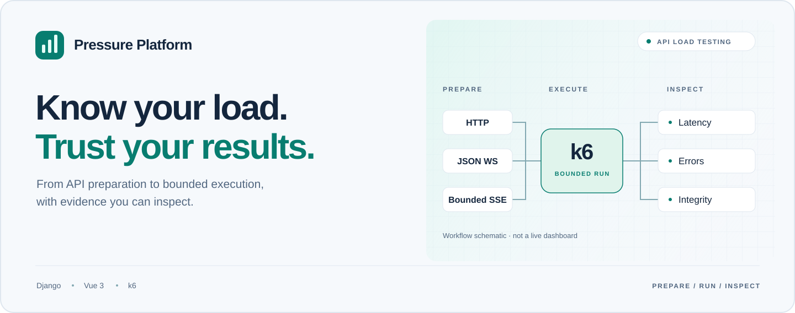

<div align="center">

<picture>
  <source media="(prefers-color-scheme: dark)" srcset="docs/assets/hero-dark.svg">
  <source media="(prefers-color-scheme: light)" srcset="docs/assets/hero-light.svg">
  
</picture>

<h1>Pressure Platform</h1>

<strong>从接口准备到结果复盘，让每一次压测都有据可查。</strong>

<p>基于 TestHub 扩展的中文性能测试管理平台。<br>用 Django、Vue 3 与 k6，串起配置准备、负载执行和报告分析。</p>

[](docs/getting-started.md)
[](testhub/frontend/)
[](testhub/docs/k6-capability-matrix.md)
[](LICENSE)

<p>
  <a href="#quick-start">快速开始</a> ·
  <a href="docs/README.md">文档中心</a> ·
  <a href="docs/architecture.md">架构说明</a> ·
  <a href="testhub/docs/k6-capability-matrix.md">能力矩阵</a> ·
  <a href="CONTRIBUTING.md">参与贡献</a>
</p>

<strong>简体中文</strong> · <a href="README.en.md">English</a>

</div>

---

## 不只是发出请求，更要解释结果

一次压测的难点，往往不在于点下“运行”，而在于：接口是否准备正确、账号是否独立、请求是否真正完成，以及报告能否解释失败与缺失。

Pressure Platform 把这些环节放进同一条工作流：**先准备、再验证、按边界执行，最后核对证据。** 它是 k6 之上的管理与分析层，不是另一个自研发压引擎，也不把上游引擎的全部能力视为平台已支持。

<table>
<tr>
<td width="50%" valign="top">
<h3>01 / 可复用的接口准备</h3>
<p>导入与更新 OpenAPI / Swagger，组织项目、持久环境和前置依赖。配置经过单轮验证后，再用于后续执行。</p>
</td>
<td width="50%" valign="top">
<h3>02 / 独立的账号与变量</h3>
<p>通过账号池、CSV 身份和变量提取组织请求。将每个虚拟用户的身份与前置登录纳入配置，而不是藏在临时脚本里。</p>
</td>
</tr>
<tr>
<td valign="top">
<h3>03 / 有边界的负载执行</h3>
<p>固定并发、每用户固定轮数或按时长运行。区分到期收尾、主动停止和未完成执行，不把结束进程等同于测试成功。</p>
</td>
<td valign="top">
<h3>04 / 明确的协议子集</h3>
<p>覆盖已接入的 HTTP 请求、有限 JSON WebSocket 会话和有界 SSE 场景。协议支持、依赖与未交付能力分别说明。</p>
</td>
</tr>
<tr>
<td valign="top">
<h3>05 / 可以继续分析的报告</h3>
<p>查看逐接口统计、错误分类及适用运行模式下的原生 VU 观测，导出 HTML、JSON、CSV，保留复盘入口。</p>
</td>
<td valign="top">
<h3>06 / 不掩盖缺失的执行记录</h3>
<p>分别展示失败、未完成、未采集与恢复记录。让结果保留上下文，而不是用一个绿色状态替代执行完整性。</p>
</td>
</tr>
</table>

## 一条完整工作流


**准备接口 → 验证配置 → 执行负载 → 分析结果。** 首页插图与上图均为工作流示意，不是产品截图或性能实测数据。实现分层见 [架构说明](docs/architecture.md)。

<a id="quick-start"></a>

## 快速开始

本地开发需要 **Python 3.12+、Node.js 22.12+、npm 和 Git**。真实发压还需要匹配的 k6 运行器；仓库不附带预编译引擎或业务账号。

```sh
git clone --recurse-submodules https://github.com/chasen2041maker/Pressure_Platform.git
cd Pressure_Platform
```

已有克隆先运行 `git submodule update --init --recursive`。`vendor/k6` 是固定源码版本，不是自动安装好的可执行程序。

| 你现在要做什么 | 从这里开始 |
| --- | --- |
| 在自己的电脑启动管理页面 | [本地启动指南](docs/getting-started.md)：虚拟环境、密钥、数据库、管理员与前端 |
| 配置真正执行请求的运行器 | [k6 适配说明](testhub/docs/k6-adapter.md)与[固定 SSE 运行时](deployment/runtime/bounded-sse/README.md) |
| 了解 Linux 单机部署方案 | [Linux Docker 部署草稿](deployment/linux-docker/README.md)：**公开版镜像与部署尚未验收** |

本地默认页面为 `http://127.0.0.1:58101`，后端为 `http://127.0.0.1:8000`。先按启动指南初始化，再使用自己创建的管理员登录。**管理页面能打开，不等于运行器已就绪。**

## 能力有边界，结果才有意义

| 范围 | 当前平台入口 | 需要知道的边界 |
| --- | --- | --- |
| HTTP | 已接入顺序请求与基础断言、提取 | 不等同于完整 `k6/http` API |
| WebSocket | 有限 JSON 会话 | 不包含任意二进制、自动重连或完整协议脚本 |
| SSE | 自定义有界扩展 | 依赖固定运行时，不是任意 k6 二进制即装即用 |
| 负载模型 | 固定并发；按轮数或时长结束 | 爬坡、到达率、分布式调度未交付；当前实例任务串行 |
| 指标 | 逐接口统计、错误与报告 | 原生 VU 是离散观测；页面 P95/P99 是累计直方图估算 |

以上是阅读导航，不替代带版本和测试证据的 [完整能力矩阵](testhub/docs/k6-capability-matrix.md)。功能验证、报告核对和目标服务容量验收是三种不同结论。

## 验证记录，而不是宣传数字

<details>
<summary><strong>查看 2026-09-22 公开源码副本的验证摘要</strong></summary>

以下引用已有 [VALIDATION.md](VALIDATION.md)，不是此次文档改版新执行的测试，也不是当前提交的 CI 状态。

| 检查范围 | 当时记录 |
| --- | --- |
| 后端维护套件 | 430 通过、40 跳过、0 失败 |
| 前端性能测试组件与逻辑 | 317 通过 |
| k6 脚本合同 | 55 通过 |
| 独立部署工具 | 33 项静态测试通过；未连接 Docker |
| 前端生产构建 | 通过，保留大体积 chunk 警告 |

完整旧套件仍有已知问题，**不能概括为“全量通过”**；跳过项不计为通过。公开版 Linux 镜像、Docker 部署与目标业务容量尚未重新验收。复现入口与历史问题见原始验证记录。

</details>

## 继续阅读

| 文档 | 内容 |
| --- | --- |
| [文档中心](docs/README.md) | 按首次使用、场景配置、运行机制和维护组织的入口 |
| [架构说明](docs/architecture.md) | 前端、API、worker、runner 与运行数据的职责 |
| [接口准备池](deployment/interface-pool.md) | 准备、单轮验证与配置复用 |
| [有界专项执行](deployment/bounded-execution.md) | 执行策略、尝试上限与策略跳过 |
| [恢复机制](deployment/reminder-recovery.md) | 执行恢复的记录与边界 |
| [贡献指南](CONTRIBUTING.md) | 开发检查、问题反馈与文档维护约定 |

## 贡献与来源

欢迎通过 [Issues](https://github.com/chasen2041maker/Pressure_Platform/issues) 提供可复现问题，或提交聚焦的改进。开始前请阅读 [贡献指南](CONTRIBUTING.md)。仅对自己拥有或已获授权的系统执行压测，公开材料不要包含真实账号、Token、内网地址或业务报告。

由 [chasen2041maker](https://github.com/chasen2041maker) 维护，基于 [TestHub](https://github.com/chenjigang4167/testhub_platform) 扩展，并使用 [Grafana k6](https://github.com/grafana/k6)。本项目不是全部从零原创的实现。根目录保留 **GPL-3.0** 许可证；k6 子模块及其他依赖保留各自许可证与版权声明。详见 [UPSTREAM.md](UPSTREAM.md) 和 [LICENSE](LICENSE)。

<p align="center"><sub>Prepare deliberately. Run within bounds. Inspect the evidence.</sub></p>
