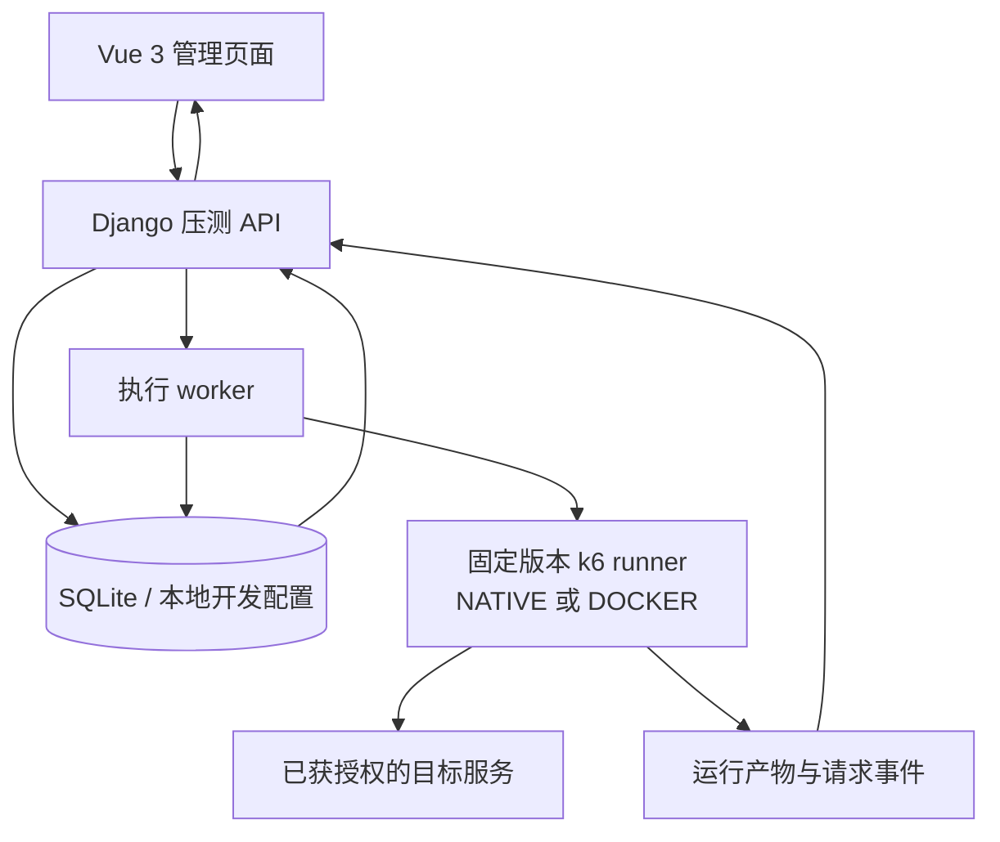

# 架构与执行边界

[文档中心](README.md) / 架构

**一个管理与分析层，一个独立执行层，一组可追溯的运行产物。**

Pressure Platform 在 TestHub 基础上扩展性能测试流程，以 Vue 3 管理配置和结果，以 Django 组织执行，以固定版本 k6 实际发出请求。以下是责任视图，不是每个函数的精确调用图，也不代表分布式集群架构。

## 责任视图

图中的 SQLite 对应本地开发配置与现有单机部署草稿，不是对所有 TestHub 运行配置的概括。worker 使用冻结配置组织执行，runner 负责发压；页面本身不是发压器。

## 模块地图

| 位置 | 职责 |
| --- | --- |
| `testhub/frontend/` | 配置准备、执行监控与报告页面 |
| `testhub/apps/perf_testing/` | 压测 API、数据模型、执行适配、统计与测试 |
| `testhub/backend/` | Django 设置与独立开发 profile |
| `deployment/linux-docker/` | 单机部署工具、镜像构建描述、配置模板与静态检查 |
| `deployment/runtime/bounded-sse/` | 有界 SSE 扩展、运行时锁与构建工具 |
| `vendor/k6/` | 固定版本的官方 k6 源码子模块 |
| `runtime/`（运行时创建） | 本机私密数据及执行产物，不属于应发布的源码 |

原 TestHub 的其他测试管理模块仍保留在 `testhub/` 中，但其存在不代表轻量压测 profile 已全部启用这些模块。

## 一次执行经过什么

**准备。** 用户组织项目、接口、环境、账号、变量和前置步骤。接口准备池负责配置准备与单轮验证，详见 [接口准备池](../deployment/interface-pool.md)。

**冻结。** 创建任务时冻结步骤、环境、账号数据及引擎相关版本信息。worker 在执行前核对运行条件，避免把后来修改的配置悄悄当作原始测试条件。不同 runner 的检查字段与限制见 [k6 适配说明](../testhub/docs/k6-adapter.md)。

**执行。** k6 运行平台生成的场景。固定轮数、按时长收尾和主动停止有不同语义；实例任务串行，不能把多线程配置解释为多个任务并发或分布式调度。专项策略的尝试次数、间隔与跳过计数见 [有界执行](../deployment/bounded-execution.md)。

**分析。** 请求事件、统计和执行产物进入监控与报告链路。报告需要保留失败、未完成、未采集和恢复记录之间的区别；页面与导出文件是同一次执行的不同阅读入口，而不是容量结论的自动证明。

## 三个容易混淆的边界

| 不要混为一谈 | 正确理解 |
| --- | --- |
| 上游 k6 能力 / 平台能力 | 只有完成入口接入与相应验证的子集才算平台可用；以 [能力矩阵](../testhub/docs/k6-capability-matrix.md) 为准 |
| 配置并发 / 原生活跃 VU / 请求吞吐 | 三者描述不同维度；离散 VU 观测不能证明每一瞬间的在途请求数 |
| 功能测试 / 部署验收 / 容量验收 | 三者需要各自证据；不能用单元测试或报告中的成功数量互相替代 |

页面 P95/P99 使用累计直方图估算；不能把窗口分位数平均后称为全局分位数。HTTP、WebSocket 会话和 SSE 的统计语义也不应仅凭相似图表直接类比。详细字段应回到适配文档与能力矩阵核对。

## 部署不是另一种宣传口径

现有 Linux Docker 文件是**单机 HTTP 部署草稿**，公开版尚未完成镜像与实际部署验收。它包含一份 SQLite、单 worker / 多线程后台及一次一个压测执行的约束，不是 Kubernetes、分布式发压或高可用集群方案。

私密数据、密钥和报告需遵循 [部署草稿](../deployment/linux-docker/README.md) 的目录与鉴权约束；本地开发服务器不能直接充当生产部署。执行异常后的恢复语义见 [恢复机制](../deployment/reminder-recovery.md)，已有验收范围见 [VALIDATION.md](../VALIDATION.md)。
